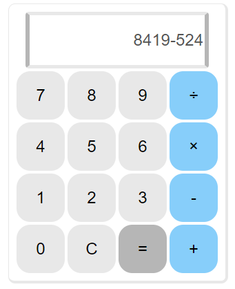

# 勉強会用　電卓リポジトリ

## 日付
2023/5/24(水) 15:30～

## 電卓アプリの開発を通して、GitHubに慣れる

最終イメージ

## 課題の流れ
### 課題1 電卓の右端列のボタンを青系の色にする

index.cssを修正します

### 課題2 急なバグ修正 ボタンの９が８になっている

stash機能を使って、課題1の変更を保留します。
index.htmlを修正します

### 課題3 電卓で計算が出来ない場合、エラーのアラートを表示する

index.js を変更します。